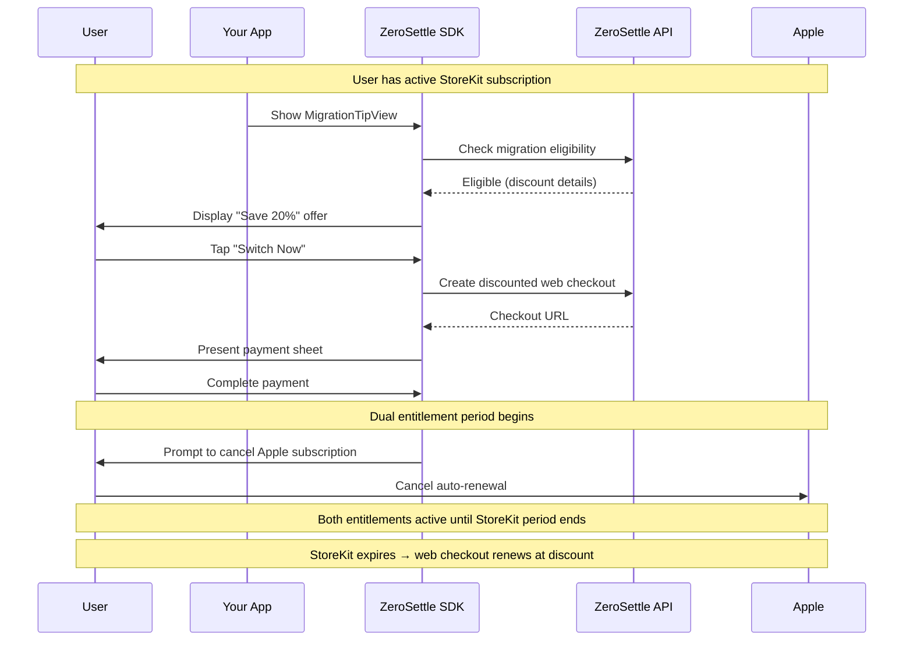

<Note>
  **`OfferTipView` is the recommended view for new integrations.** It supersedes `MigrationTipView` and handles migration, StoreKit-to-web upgrades, and web-to-web upgrades from a single component. See [Offer Tip View](/iap/offer-tip-view).

  `MigrationTipView` is `@available(*, deprecated)` as of ZeroSettleKit 1.1.5. The legacy `ZSMigrateTipView` typealias still resolves to `MigrationTipView` for source compatibility.
</Note>

`OfferTipView` is the canonical drop-in view going forward — it prompts eligible users to switch from Apple billing to direct billing at a discount, and additionally surfaces upgrade offers when configured. It manages its own visibility, checkout flow, and dismissal state. You just add it to your layout.

`MigrationTipView` (documented below for reference) continues to work for legacy integrations but new code should prefer `OfferTipView`.

<Frame caption="MigrationTipView embedded in a settings screen">
  
</Frame>

<iframe
  className="w-full aspect-video rounded-xl"
  src="https://www.youtube.com/embed/M1kBXsMTKL8"
  title="Switch and Save Demo"
  allow="accelerometer; autoplay; clipboard-write; encrypted-media; gyroscope; picture-in-picture"
  allowFullScreen
></iframe>

## How Switch & Save Works

The migration flow lets existing StoreKit subscribers switch to web checkout billing at a discounted price. Here's the timeline:



<Note>
  After switching, the user has **two active entitlements** temporarily — the existing StoreKit subscription (running out its paid period) and the new web checkout subscription. This overlap is intentional: the user already paid Apple for the current period and shouldn't lose access early. The StoreKit entitlement expires naturally.
</Note>

## Play Store (Android)

Switch & Save also works for **Google Play Billing** subscribers on Android. The user flow mirrors the StoreKit flow — the subscriber switches to discounted web billing, keeps Play access until their current period ends, and the old Play subscription is cancelled — with two key Android-specific differences:

1. **The migration runs through Google's External Content Link (ECL) billing program.** Android does not have an iOS-style payment sheet. The Android SDK opens Google's ECL disclosure dialog, then a Chrome Custom Tab to the migration session — it does **not** present an in-app WebView checkout (that would violate Google Play policy).
2. **ZeroSettle's backend cancels the Play subscription programmatically** via the Play Developer API after the migration completes (StoreKit can't be cancelled server-side, so Apple users have to do it themselves in iOS Settings).

<Steps>
  <Step title="Configure Real-time Developer Notifications (RTDN)">
    RTDN must be wired up for your Play app (this is the same prerequisite as the [Play Billing integration](/iap/play-billing-integration)). The backend uses the `SUBSCRIPTION_CANCELED` RTDN to reconcile the post-migration cancellation, and a periodic sweep as a backstop if an RTDN is missed.
  </Step>
  <Step title="The SDK launches the ECL Switch & Save flow">
    The Android SDK checks ECL availability on the device, requests a single-use Play Billing attribution token, exchanges it with the backend (`POST /v1/iap/switch-and-save/session/`) for a migration-session URL, then opens Google's ECL disclosure dialog and — on acknowledgement — the migration URL in a Chrome Custom Tab. If the device or account is not enrolled in the ECL program, the offer is suppressed (the SDK never shows a dead CTA).
  </Step>
  <Step title="The backend cancels the Play subscription (best-effort)">
    After the migration completes, ZeroSettle calls `subscriptionsv2.cancel` for the user's old Play subscription, with retries. If the cancellation can't be completed (e.g., Play returns a permanent error, or it keeps failing), the transaction is flagged for **manual intervention** instead of silently failing.
  </Step>
  <Step title="The SDK surfaces a fallback banner when needed">
    When the backend couldn't cancel the Play subscription, [`GET /iap/entitlements/`](/api-reference/endpoint/get-entitlements) returns a `manual_play_cancel` entry in `pending_actions[]`. The SDK renders a banner with a deep link to the Play Store subscriptions screen so the user can cancel it themselves. The user keeps their new web subscription regardless. The SDK dismisses the banner via [`POST /iap/migration-actions/{transaction_id}/dismiss/`](/api-reference/endpoint/dismiss-migration-action) once the user acts on it. See [Pending Actions](/sdk/android/pending-actions).
  </Step>
</Steps>

<Note>
  Just like the Apple flow, the user keeps their **Play Store access until the current billing period ends** — the old Play subscription isn't revoked early. After it expires, the web subscription is the only active one. Right after migration the SDK also surfaces a one-time `migration_completed_info` banner explaining this.
</Note>

### Android API

On Android, the Switch & Save flow is driven through the unified `OfferManager` — a `MIGRATE_PLAY_TO_WEB` offer is accepted with the `Activity` overload:

```kotlin
val mgr = ZeroSettle.offerManager()
mgr.evaluate()
// For a MIGRATE_PLAY_TO_WEB offer, acceptOffer REQUIRES an Activity:
mgr.acceptOffer(activity)
```

The drop-in `ZeroSettleOfferTip` Composable (`:ui` module) handles this routing automatically. For a fully custom flow, `ZeroSettle.launchSwitchAndSave(activity)` is the headless entry point. See [Offers (Android)](/sdk/android/offers).

The discount, copy, tenure, and rollout for the Play campaign are configured in the [dashboard Switch & Save campaign](/iap/dashboard#migration-campaigns), the same as the Apple campaign — campaigns carry a platform (Apple, Google, or both).

## Usage

<CodeGroup>

```swift SwiftUI
MigrationTipView(
    userId: currentUser.id,
    stripeCustomerId: "cus_abc123",                  // optional
    backgroundColor: .black,                        // optional
    titleFont: .system(size: 20, weight: .bold),    // optional
    bodyFont: .system(size: 16),                     // optional
    ctaFont: .system(size: 17, weight: .bold),       // optional
    borderColor: .white.opacity(0.2),                // optional
    onEvent: { event in                              // optional
        switch event {
        case .ctaTapped:              print("user tapped CTA")
        case .checkoutCompleted:      print("web checkout succeeded")
        case .appleSubscriptionManagementOpened:
                                      print("opened Apple sub management")
        case .migrationCompleted:     print("full migration done")
        case .dismissed:              print("view dismissed")
        }
    }
)
```

```tsx React Native
import { ZSMigrateTipView } from 'react-native-zerosettle';

<ZSMigrateTipView
  userId={currentUser.id}
  stripeCustomerId="cus_abc123"            // optional
  backgroundColorHex="#1E1E1E"
  style={{ marginHorizontal: 16 }}
/>
```

```dart Flutter
import 'package:zerosettle/zerosettle.dart';

MigrationTipView(
  userId: currentUser.id,
  backgroundColor: Color(0xFF1E1E1E),
)
```

```kotlin Kotlin
// Android does not use MigrationTipView. The unified ZeroSettleOfferTip Composable
// (from the optional :ui module) renders Play→web Switch & Save offers.
val mgr = ZeroSettle.offerManager()
ZeroSettleOfferTip(offerManager = mgr)
```

</CodeGroup>

The iOS, React Native, and Flutter views share the same native implementation. On Android, Switch & Save is exposed differently — see the [Android API](#android-api) section above and [Offers (Android)](/sdk/android/offers).

<Note>
  `MigrationTipView` targets iOS / React Native / Flutter apps switching users from **Apple StoreKit** subscriptions. On Android, use the unified `ZeroSettleOfferTip` Composable, which handles both Play→web Switch & Save migrations and upgrade offers.
</Note>

## Automatic Visibility

The view decides whether to render itself based on the user's entitlement state. You never need to write conditional logic around it.

| Condition | Behavior |
|-----------|----------|
| User has a StoreKit subscription that matches the dashboard-configured product | ✅ View appears (user is eligible to switch and save) |
| User already has a web checkout entitlement | 🚫 View is hidden (already switched) |
| User has no active subscription | 🚫 View is hidden (not a switch and save candidate) |
| User previously dismissed the view | 🚫 View is hidden (dismissal persisted via `UserDefaults`) |
| User has not been subscribed long enough | 🚫 View is hidden (e.g., user subscribed less than 90 days ago) |
| User is not in the rollout cohort | 🚫 View is hidden (phased rollout has not reached this user yet) |

The minimum subscription age and rollout percentage are configured in the [dashboard switch and save campaign](/iap/dashboard#migration-campaigns). For example, you can set the minimum to 90 days so only users subscribed for at least 90 days see the view, and roll out to 10% of eligible users first before going to 100%. This lets you target loyal, high-retention users and control exposure as you ramp up.

On mount, the view checks the minimum subscription age and evaluates the rollout cohort from your dashboard config. If none of the conditions for showing are met, it renders as an `EmptyView` with no layout impact.

## Placement

The view works anywhere a standard view does. Settings screens and account pages tend to convert best.

<CodeGroup>

```swift Settings Screen
List {
    Section("Account") {
        // your existing rows...
    }

    MigrationTipView(userId: user.id, backgroundColor: .blue)
        .listRowInsets(EdgeInsets())
        .listRowBackground(Color.clear)
}
```

```swift Profile / Home Screen
VStack(spacing: 16) {
    // your existing content...

    MigrationTipView(userId: user.id, backgroundColor: .indigo)
        .padding(.horizontal, 16)
}
```

```swift ScrollView
ScrollView {
    // ...
    MigrationTipView(userId: user.id)
}
```

```tsx React Native Settings
<ScrollView>
  {/* your existing content... */}
  <OfferTipView
    userId={user.id}
    backgroundColorHex="#0000FF"
    style={{ marginHorizontal: 16 }}
  />
</ScrollView>
```

```dart Flutter Settings
ListView(
  children: [
    // your existing rows...
    MigrationTipView(
      userId: user.id,
      backgroundColor: Color(0xFF0000FF),
    ),
  ],
)
```

```dart Flutter Profile / Home
Column(
  children: [
    // your existing content...
    Padding(
      padding: EdgeInsets.symmetric(horizontal: 16),
      child: MigrationTipView(
        userId: user.id,
        backgroundColor: Color(0xFF3F00B5),
      ),
    ),
  ],
)
```

```kotlin Kotlin
// The Android SDK does not yet ship a built-in migration widget. Use the headless
// `MigrationPrompt` model from the SDK to drive your own UI — fetch the prompt via
// `ZeroSettle.getMigrationPrompt(...)`, then render it however your app design dictates.
// A built-in component is on the roadmap.
```

</CodeGroup>

## Parameters

### All platforms

| Parameter | Type | Default | Description |
|-----------|------|---------|-------------|
| `userId` | `String` | Required | The user identifier passed to the checkout backend. |
| `stripeCustomerId` | `String?` | `nil` | Optional existing Stripe Customer ID (`cus_xxx`). When provided, the checkout is attached to this customer instead of creating a new one. Useful for a unified [Billing Portal](https://docs.stripe.com/customer-management/integrate-customer-portal) view. |
| `backgroundColor` | `Color` (SwiftUI, Flutter) / `string` (React Native) | `.black` / `"#000000"` | Background color for the card. Pass a `Color` in SwiftUI and Flutter, or a hex string in React Native. |

### SwiftUI only

These optional parameters are available on the native SwiftUI view. React Native and Flutter wrappers use the defaults.

| Parameter | Type | Default | Description |
|-----------|------|---------|-------------|
| `titleFont` | `Font?` | System bold | Custom font for the title text. |
| `bodyFont` | `Font?` | System default | Custom font for the body/message text. |
| `ctaFont` | `Font?` | System bold | Custom font for the CTA button text. |
| `borderColor` | `Color?` | `nil` (no border) | Border color applied as a rounded rectangle stroke on the card. |
| `onEvent` | `((MigrationTipView.Event) -> Void)?` | `nil` | Closure invoked when a lifecycle event occurs. See **Event Types** below. |

The button copy, discount amount, and messaging are controlled from the [dashboard switch and save campaign](/iap/dashboard#migration-campaigns). No code change needed.

### Event Types

The `onEvent` callback receives a `MigrationTipView.Event` value as the user progresses through the migration flow:

| Event | When it fires |
|-------|--------------|
| `.ctaTapped` | The user tapped the main CTA button to begin checkout. |
| `.checkoutCompleted` | The web checkout completed successfully. The user now has a web entitlement, but their Apple subscription is still active. |
| `.appleSubscriptionManagementOpened` | The user opened Apple's subscription-management sheet to cancel their Apple billing. |
| `.migrationCompleted` | The full migration flow is finished — web checkout succeeded **and** the Apple subscription-management sheet was shown. |
| `.dismissed` | The view was dismissed (close button, auto-dismiss after completion, or the user became ineligible). |

Events fire in lifecycle order: `ctaTapped` → `checkoutCompleted` → `appleSubscriptionManagementOpened` → `migrationCompleted` → `dismissed`. Not every event is guaranteed — for example, a user who dismisses the view before completing checkout will only trigger `ctaTapped` then `dismissed`.

<Note>
  `onDismiss` is deprecated but still works. It maps to `onEvent` and only fires on `.dismissed`. Migrate to `onEvent` for full visibility into the flow.
</Note>

## Experimentation

The discount, messaging, and targeting are all controlled from the [dashboard](/iap/dashboard#migration-campaigns), so you can iterate without shipping an app update.

| Setting | What it controls |
|---------|-----------------|
| **Discount %** | The percentage off the web price shown in the CTA (e.g., 15% off) |
| **Title** | The heading displayed in the tip view |
| **Message** | The body text explaining the offer |
| **Minimum subscription age** | Minimum subscription age in days before the view appears |
| **Rollout %** | Percentage of eligible users who see the view |

Adjust these at any time to test different offers. For example, start with a 10% discount at 180 days tenure rolled out to 10% of users, then broaden to 15% off at 90 days for 100% of users and compare conversion rates in your dashboard analytics.

## Debugging

The view may be hidden during development because it was previously dismissed. Reset the persisted state:

<CodeGroup>

```swift SwiftUI
ZSMigrationManager.resetDismissedState()
```

```tsx React Native
// Not available in the React Native SDK — the dismissed-state reset
// API is not exposed by react-native-zerosettle. To re-test the tip
// during development, reinstall the app to clear persisted state.
```

```dart Flutter
await ZeroSettle.instance.resetMigrateTipState();
```

```kotlin Kotlin
// Not available on Android — ZSMigrateTipView is iOS-only.
```

</CodeGroup>

<Note>
  `ZSMigrateTipView.resetMigrateTipState()` still works but is deprecated. Use `ZSMigrationManager.resetDismissedState()` instead.
</Note>

### Region Override

The migration tip is restricted to US-region devices. To test from other regions, force the jurisdiction check:

<CodeGroup>

```swift SwiftUI
// Force US jurisdiction — tip will appear regardless of device locale
ZSMigrationManager.forceUSARegion()

// Reset to real jurisdiction detection
ZSMigrationManager.resetRegionOverride()
```

```tsx React Native
// Not available in the React Native SDK — region-override APIs are not
// exposed by react-native-zerosettle. To test the migration tip from a
// non-US region, use a US-region device or simulator.
```

```dart Flutter
await ZeroSettle.instance.forceUSARegion();

// Reset to real jurisdiction detection
await ZeroSettle.instance.resetRegionOverride();
```

</CodeGroup>

<Note>
This is a debug tool — do not ship with `forceUSARegion()` enabled. Unlike `demoMode`, this only bypasses the region check. All other eligibility checks (active StoreKit subscription, rollout, tenure, etc.) still apply.
</Note>

The view logs its visibility decisions to the console with the prefix `[ZSMigrateTipView Business Logic]`, including which condition caused it to show or hide.

## Next Steps

<CardGroup cols={2}>
  <Card title="Offer Tip View" icon="gift" href="/iap/offer-tip-view">
    Unified view for migration and upgrade offers
  </Card>
  <Card title="Custom Switch and Save UI" icon="wand-magic-sparkles" href="/iap/migration-manager">
    Build your own switch and save experience with ZSMigrationManager
  </Card>
  <Card title="Dashboard" icon="gauge" href="/iap/dashboard#migration-campaigns">
    Configure your switch and save campaign and discount
  </Card>
  <Card title="StoreKit Integration" icon="apple" href="/iap/storekit-integration">
    Run StoreKit and web checkout side by side
  </Card>
</CardGroup>
